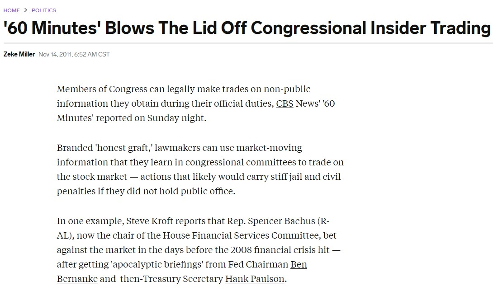
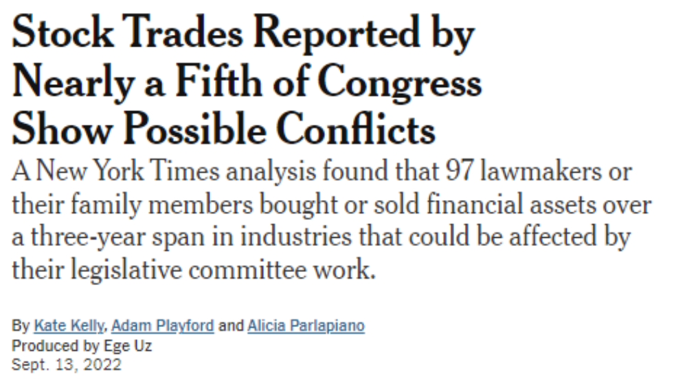
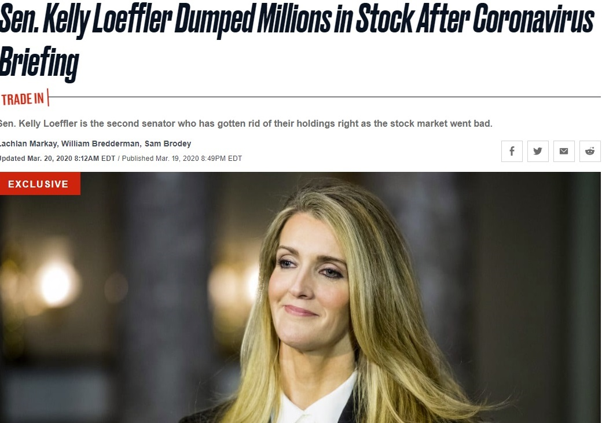
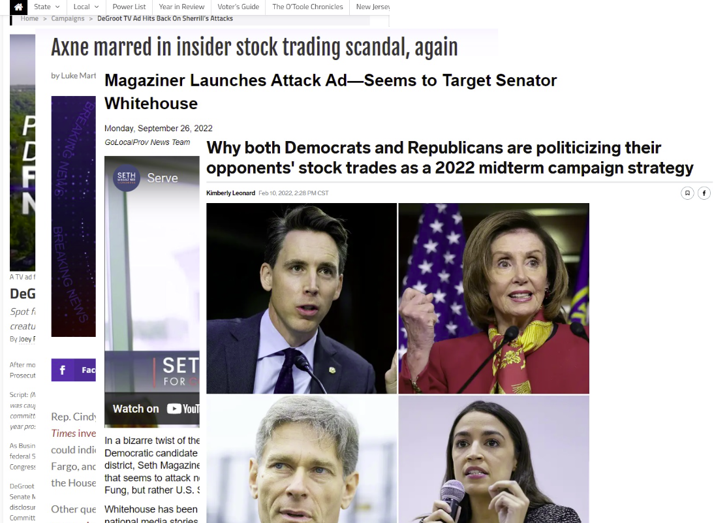
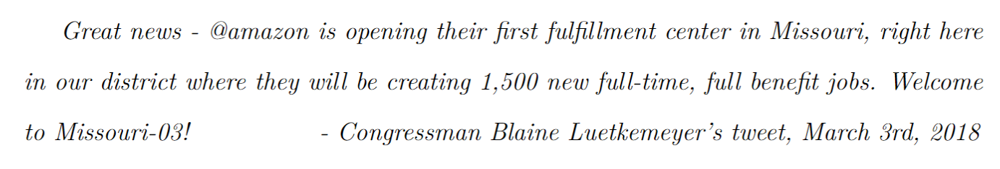
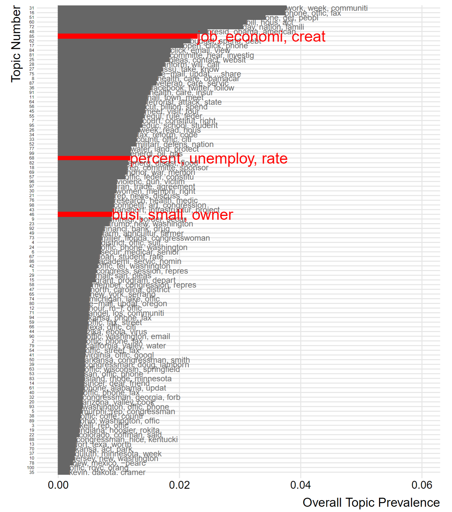
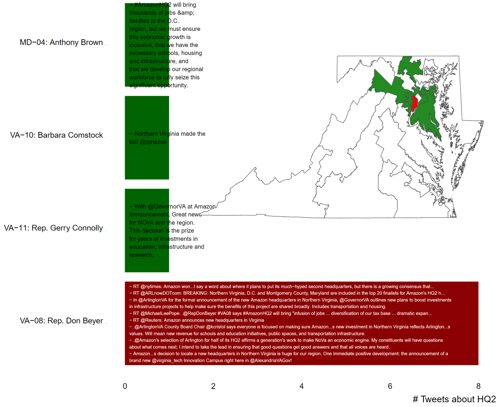

```{css,echo = F}
.small .remark-code { /*Change made here*/
  font-size: 85% !important;
}
.tiny .remark-code { /*Change made here*/
  font-size: 50% !important;
}

.inverse {
  background-color: #272822;
  color: #d6d6d6;
  text-shadow: 0 0 20px #333;
  background-image: none!important;
}

.huge {
  font-size: 500%;
}

.center2 {
  margin: 0;
  position: absolute;
  top: 50%;
  left: 30%;
  -ms-transform: translate(-50%, -50%);
  transform: translate(-50%, -50%);
}

.xe-banner {
  position:fixed;
  background:#866D4B;
  color:rgba(255,255,255,0.5);
}

.remark-slide-number {
  position:fixed;
  bottom:10px;
  color:white
}
```

```{r,include=F}
set.seed(123)
options(width=60)
knitr::opts_chunk$set(fig.align='center',fig.width=8,fig.height=3,dpi=300)
def.chunk.hook  <- knitr::knit_hooks$get("chunk")
knitr::knit_hooks$set(chunk = function(x, options) {
  x <- def.chunk.hook(x, options)
  ifelse(options$size != "normalsize", paste0("\n \\", options$size,"\n\n", x, "\n\n \\normalsize"), x)
})
require(tidyverse)
require(ggpubr)
```

```{r xaringanExtra, echo = FALSE}
  xaringanExtra::use_progress_bar(color = "#866D4B", location = "top")
  # xaringanExtra::use_banner(
  #   bottom_left = "Stocks and Jobs: SPSA 2024",
  #   bottom_center = "Bisbee & Clinton",
  #   # bottom_left = "jamesbisbee.com/StocksToShare/spsa_2024_presentation",
  #   exclude = c("title-slide")
  # )
```


# Agenda

1. Theoretical intuition

2. Data description

3. Methods

4. Descriptive evidence

5. Next steps


---

# Public Perception

.leftcol[

- Politicians are **corrupt**!

]

.rightcol[



]


---

# Public Perception

.leftcol[

- Politicians are **corrupt**!

- High salience examples of insider trading

]

.rightcol[



]


---

# Public Perception

.leftcol[

- Politicians are **corrupt**!

- High salience examples of insider trading

- Covid-19 panic

]

.rightcol[


]

---

# Public Perception

.leftcol[

- Politicians are **corrupt**!

- High salience examples of insider trading

- Covid-19 panic

]

.rightcol[



]

---

# Public Perception

.leftcol[

- Politicians are **corrupt**!

- High salience examples of insider trading

- Covid-19 panic

- Lots of **attention**!

]

.rightcol[


]

---

# Public Perception

.leftcol[

- Politicians are **corrupt**!

- High salience examples of insider trading

- Covid-19 panic

- Lots of **attention**!

]

.rightcol[


]

---

# Public Perception

.leftcol[

- Politicians are **corrupt**!

- High salience examples of insider trading

- Covid-19 panic

- Lots of **attention**!

]

.rightcol[


]

---

# Public Perception

.leftcol[

- Politicians are **corrupt**!

- High salience examples of insider trading

- Covid-19 panic

- Lots of **attention**!

]

.rightcol[



]

---

# What we know

1. Politicians' trades exhibit suspicious timing and outperform market indices (Ziobrowski et al, [2004](https://www.cambridge.org/core/services/aop-cambridge-core/content/view/A39406479940758D59E09FDCB8EE9BEC/S0022109000003161a.pdf/abnormal_returns_from_the_common_stock_investments_of_the_us_senate.pdf), [2011](https://www.researchgate.net/profile/James-Boyd-11/publication/227378283_Abnormal_Returns_From_the_Common_Stock_Investments_of_Members_of_the_US_House_of_Representatives/links/00b7d529940f62034d000000/Abnormal-Returns-From-the-Common-Stock-Investments-of-Members-of-the-US-House-of-Representatives.pdf?_sg%5B0%5D=started_experiment_milestone&origin=journalDetail&_rtd=e30%3D))
  
  a. Conversely, they're not very good at it (Eggers & Hainmueller, [2013](https://www.journals.uchicago.edu/doi/abs/10.1017/S0022381613000194?casa_token=TBHP6VNA7jgAAAAA%3AhVwvX9_bK3EgZaKmYzid5my0uxcrl5Ey7OxPZty5XiPFCu1LqbDtoQ9VJz9s_A9k9IgLxamCcmmQ&journalCode=jop))
  
  b. **Puzzle #1**: Which is it?

--

2. They invest more in firms headquartered in their district (Eggers & Hainmueller, [2014](https://web.stanford.edu/~jhain/Paper/QJPS2014.pdf))

  a. These stocks **do** outperform market and rest of their portfolio, but no evidence for insider trading specifically.
  
  b. **Puzzle #2**: Why do they invest locally?


---

# Sketch of Theory

- Politicians are either **wealth-motivated** or **office-motivated**

--

- If **wealth-motivated**, they should exploit privileged information to make money off of insider trading

  - Politicians learn about industry and firm-level opportunities and challenges while serving on committees or being lobbied by firms
  
  - Politicians can influence markets via regulations and policies (might even improve perception of firm strength simply *by investing*)
  
  - Privileged information creates opportunities for **insider trading**

--

- If **office-motivated**, they should condition trading behavior to maximize re-election / protect against challengers

  - Trading behavior is public
  
  - Challengers can use it to attack incumbents

---

# Sketch of Theory

- Most likely both motivations are at play, but passage of STOCK Act (2012) makes wealth-motivation far riskier

  - **S**top **T**rading **o**n **C**ongressional **K**nowledge

  - Explicitly prohibits trading based on non-public information

  - Increases cadence of reporting to within 45 days
  
--

- What types of investments improve re-election chances?

--

1. Investments that do not appear corrupt

2. Investments that maximize constituent welfare

--

- I.e., **local investments**

---

# Politicians `r emo::ji('heart')` Jobs

--



--

.pull-right[ ]

--




---

# Politicians `r emo::ji('heart')` Jobs...in their district

<center></center>

<!-- Have ready: did the VA-08 representative invest in Amazon? -->

# Hypotheses

- Politicians invest *more* in firms that employ their constituents

---

class: inverse

# 

.center2[
.huge[DATA]

.huge[DESCRIPTION]]

---

# Stocks (outcome)

.leftcol[

- **Capitol Trades**

]

.rightcol[

<center> </center>

]

---

# Stocks (outcome)

.leftcol[

- **Capitol Trades**

  - Cleaned data from stocks trading disclosures

]

.rightcol[

<center> </center>

]

---

# Stocks (outcome)

.leftcol[

- **Capitol Trades**

  - Cleaned data from stocks trading disclosures
  
  - Politicians indicated with `bioguide_id`

]

.rightcol[

<center> </center>

]

---

# Stocks (outcome)

.leftcol[

- **Capitol Trades**

  - Cleaned data from stocks trading disclosures
  
  - Politicians indicated with `bioguide_id`
  
  - Companies indicated with `GVKEY`

]

.rightcol[

<center> </center>

]


---

# Stocks (outcome)

- Currently only have one year of data from Nov 22 - Nov 23 (been waiting on 2012-2023 since November)

```{r,echo=F,warning=F}
load('../Data/Prepped/ap_workshop_example.RData')
dat %>%
  select(trans_id = TransactionId,trans_date = TransactionDate,trans_type = TransactionType,bioguide_id = ReportingIndividualId,gvkey = CompanyId,Amount) %>%
  mutate_at(vars(trans_id,gvkey),as.character) %>%
  head(10)
```

---

# Stocks (outcome)

```{r,echo=F,warning=F,message=F,fig.align='center',fig.width=16,fig.height=6.5,dpi=72}
require(plotly)
p <- toanal %>%
  count(ReportingIndividualId,PoliticalParty,FullName) %>%
  arrange(desc(n)) %>%
  ggplot(aes(x = n,y = reorder(FullName,n),fill = PoliticalParty,text = paste0(FullName,': ',n))) + 
  geom_bar(stat = 'identity') + 
  scale_x_log10() + 
  theme_bw() + 
  scale_fill_manual(values = c('blue','forestgreen','red')) + 
  labs(x = 'Number of Transactions (log scale)',
       y = NULL,
       title = 'Total Transactions by MC',
       subtitle = '2022 Data Only')

ggplotly(p,tooltip = 'text')
```

---

# Stocks (outcome)

```{r,echo=F,warning=F,message=F,fig.align='center',fig.width=16,fig.height=6.5,dpi=72}
p <- toanal %>%
  filter(TransactionType %in% c('BUY','SELL')) %>%
  group_by(ReportingIndividualId,PoliticalParty,FullName,TransactionType) %>%
  summarise(nTrans = n(),
            nComp = length(unique(CompanyId)),
            amount = sum(Amount)) %>%
  ungroup() %>%
  ggplot(aes(x = nTrans,y = nComp,size = amount,color = PoliticalParty,text = paste0(FullName,': ',PoliticalParty,'\n',
                                                                                     'Total Amount: ',scales::dollar(round(amount)),'\n',
                                                                                     '# Transactions: ',nTrans,'\n',
                                                                                     '# Unique Companies: ',nComp))) + 
  geom_point(pch = 21) + 
  scale_x_log10() + 
  scale_y_log10() + 
  scale_fill_manual(values = c('blue','forestgreen','red')) + 
  theme_bw() + 
  theme(legend.position = 'none') + 
  labs(x = '# of Transactions (log scale)',
       y = '# of Companies (log scale)',
       title = 'Investments by Politicians') + 
  facet_wrap(~TransactionType)

ggplotly(p,tooltip = 'text')
```


---

# Jobs (predictor)

.leftcol[

- **ReferenceUSA**

]

.rightcol[

<center> </center>

]

---

# Jobs (predictor)

.leftcol[

- **ReferenceUSA**

  - Dataset of where firms employ people
  
]

.rightcol[

<center> </center>

]

---

# Jobs (predictor)

.leftcol[

- **ReferenceUSA**

  - Dataset of where firms employ people
  
  - Plants linked with **parent-company** via `ABI` ID
  
]

.rightcol[

<center> </center>

]

---

# Jobs (predictor)

.leftcol[

- **ReferenceUSA**

  - Dataset of where firms employ people
  
  - Plants linked with **parent-company** via `ABI` ID
  
  - Manually scraped website to link `GVKEY` with `ABI`
]

.rightcol[

<center> </center>

]

---

# Jobs (predictor): Apple Example

```{r,echo=F,warning=F,message=F,fig.align='center',fig.width=16,fig.height=6.5,dpi=72}
require(maps)
usa <- map_data('usa')
require(ggthemes)

toplot <- dt %>%
  filter(par_ABI == 008264145)

p <- ggplot(mapGeo,aes(x = long,y = lat,group = group)) + 
  geom_polygon(fill = 'white',size = .5,color = 'grey80') + 
  # geom_polygon(data = usa,aes(x = long,y = lat,group = group),fill = NA,color = 'black',size = 1.2) +
  geom_point(data = toplot %>% mutate(empBin = as.numeric(cut(employees,c(0,5,50,100,500,Inf)))),
             aes(x = Longitude,y = Latitude,size = employees,text = paste0(plant_name,'\n',
                                                                           City,', ',State,'\n',
                                                                           'Employees: ',employees)),inherit.aes = F,pch = 21,alpha = 1) +
  scale_size_continuous(name = '# Employees',range = c(1,10),breaks = c(10,50,100,250,500)) +
  xlim(c(-125,-67)) + 
  ylim(c(23,50)) + 
  coord_map('albers',lat0 = 39,lat1 = 45) + 
  theme_map() + 
  theme(legend.position = 'none')
ggplotly(p,tooltip = 'text')
```


---

# Jobs (predictor): Southern CA Edison Co.

```{r,echo=F,warning=F,message=F,fig.align='center',fig.width=16,fig.height=6.5,dpi=72}
toplot <- dt %>%
  filter(par_ABI == 6066187)

p <- ggplot(mapGeo,aes(x = long,y = lat,group = group)) + 
  geom_polygon(fill = 'white',size = .5,color = 'grey80') + 
  # geom_polygon(data = usa,aes(x = long,y = lat,group = group),fill = NA,color = 'black',size = 1.2) +
  geom_point(data = toplot %>% mutate(empBin = as.numeric(cut(employees,c(0,5,50,100,500,Inf)))),
             aes(x = Longitude,y = Latitude,size = employees,text = paste0(plant_name,'\n',
                                                                           City,', ',State,'\n',
                                                                           'Employees: ',employees)),inherit.aes = F,pch = 21,alpha = 1) +
  scale_size_continuous(name = '# Employees',range = c(1,10),breaks = c(10,50,100,250,500)) +
  xlim(c(-125,-67)) + 
  ylim(c(23,50)) + 
  coord_map('albers',lat0 = 39,lat1 = 45) + 
  theme_map() + 
  theme(legend.position = 'none')
require(plotly)
ggplotly(p,tooltip = 'text')
```

---

# Jobs (predictor): U-Haul

```{r,echo=F,warning=F,message=F,fig.align='center',fig.width=16,fig.height=6.5,dpi=72}
toplot <- dt %>%
  filter(par_ABI == 409125614)

p <- ggplot(mapGeo,aes(x = long,y = lat,group = group)) + 
  geom_polygon(fill = 'white',size = .5,color = 'grey80') + 
  # geom_polygon(data = usa,aes(x = long,y = lat,group = group),fill = NA,color = 'black',size = 1.2) +
  geom_point(data = toplot %>% mutate(empBin = as.numeric(cut(employees,c(0,5,50,100,500,Inf)))),
             aes(x = Longitude,y = Latitude,size = employees,text = paste0(plant_name,'\n',
                                                                           City,', ',State,'\n',
                                                                           'Employees: ',employees)),inherit.aes = F,pch = 21,alpha = 1) +
  scale_size_continuous(name = '# Employees',range = c(1,10),breaks = c(10,50,100,250,500)) +
  xlim(c(-125,-67)) + 
  ylim(c(23,50)) + 
  coord_map('albers',lat0 = 39,lat1 = 45) + 
  theme_map() + 
  theme(legend.position = 'none')
require(plotly)
ggplotly(p,tooltip = 'text')
```

---

class: inverse

# 

.center2[
.huge[METHODS]]

---

# What is our [estimand](https://journals.sagepub.com/doi/abs/10.1177/00031224211004187?journalCode=asra)?

- **If**: politicians want to maximize jobs

- **Then**: they will invest in employers

--

- Big challenge: if the intuition is true, are politicians job **creators** or job **expanders** or job **maintainers**?

--

  - "Creator": new firms / plants that weren't **there** before
  
  - "Expander": new jobs at firms / plants that were **there** before
  
  - "Maintainer": preventing job loss at firms / plants that were **there** before
  
--

- Assuming that more jobs $\Rightarrow$ more votes, they should be all three

--

- But for now, let's assume they are *not* **creators** (ruling out **prospective** behavior)

- Investment decisions are *local* and *retrospective*

---

# Estimand

- Investment by MoC $p$ in firm $f$

  - Binary indicator of any investment
  
  - Count of total shares
  
  - Sum of total amount
  
--

- Selection: 

  1. not every politician invests
  
  2. not every firm is invested in

- Need to create dyadic dataset of every possible politician by every possible publicly-traded firm

---

# Estimation

$$
\begin{aligned}
\textit{invest}_{p,f,t} &= \alpha_{p} + \gamma_f + \beta_1 \textit{jobs}_{p,f,t-1} + u_{p,f,t}
\end{aligned}
$$

- where $p$ is the politician investing in a stock, $f$ is the firm they invest in, and $t$ is when they invest

--

  - $\alpha_p$ are politician fixed effects
  
  - $\gamma_f$ are firm fixed effects

  - Two-way cluster robust standard errors on $p$ and $f$

--


- Given current bottleneck on data, we will predict investing decisions in 2022 as a function of jobs in 2018

  - Don't yet have dyadic data built either
  
  - **VERY PRELIMINARY**

---

class: inverse

# 

.center2[
.huge[RESULTS]]


---

# Descriptive Visualization

- How much more do politicians invest in firms that employ their constituents relative to other firms?

```{r,warning=F,message=F,echo=F}
toanal2 <- toanal %>%
  group_by(ReportingIndividualId,ref_usa,TransactionType,FullName,PoliticalParty) %>%
  summarise(totAmount = sum(Amount),
            nTrans = n(),
            nsubs = sum(nsubs),
            nemp = sum(nemp)) %>%
  ungroup()

toanal2 %>%
  filter(TransactionType %in% c('BUY','SELL')) %>%
  ggplot(aes(x = nsubs,y = nTrans)) + 
  geom_point(shape = 21) +
  geom_smooth() + 
  theme_bw() + 
  labs(x = 'Number of Subsidiaries',
       y = 'Number of Transactions',
       title = 'Bivariate Non-Linear Descriptives',
       subtitle = 'Raw measures',
       size = 'Count of Politician-Company') + 
  facet_grid(~TransactionType) + 
  theme(legend.position = 'bottom')
```

---

# Descriptive Visualization

- How much more do politicians invest in firms that employ their constituents relative to other firms?

```{r,warning=F,message=F,echo=F}
toanal2 %>%
  filter(TransactionType %in% c('BUY','SELL')) %>%
  ggplot(aes(x = nsubs,y = nTrans)) + 
  geom_jitter(width = .25,height = .25,shape = 21) +
  scale_x_log10() +
  scale_y_log10() +
  geom_smooth() + 
  theme_bw() + 
  labs(x = 'Number of Subsidiaries (logged)',
       y = 'Number of Transactions (logged)',
       title = 'Bivariate Non-Linear Descriptives',
       subtitle = 'Logged measures, visualized with jitter',
       size = 'Count of Politician-Company') + 
  facet_grid(~TransactionType) + 
  theme(legend.position = 'bottom')
```

---

# Descriptive Visualization

- How much more do politicians invest in firms that employ their constituents relative to other firms?

```{r,warning=F,message=F,echo=F}
require(marginaleffects)
toanal2 %>%
  filter(TransactionType %in% c('BUY','SELL')) %>%
  mutate(nsubs = nsubs + 1) %>%
  ggplot(aes(x = nsubs,y = nTrans)) + 
  geom_jitter(width = .15,height = .15,shape = 21) +
  scale_x_log10() +
  scale_y_log10() +
  geom_smooth() + 
  theme_bw() + 
  labs(x = 'Number of Subsidiaries (logged)',
       y = 'Number of Transactions (logged)',
       title = 'Bivariate Non-Linear Descriptives',
       subtitle = 'Logged+1 measures, visualized with jitter',
       size = 'Count of Politician-Company') + 
  facet_grid(~TransactionType) + 
  theme(legend.position = 'bottom')
```

---

# Regression Results

$$
\begin{aligned}
\textit{invest}_{p,f,t} &= \alpha_{p} + \gamma_f + \beta_1 \textit{jobs}_{p,f,t-1} + u_{p,f,t}
\end{aligned}
$$
```{r,message=F,warning=F}
require(fixest)

m1 <- feols(log(nTrans) ~ log(nsubs+1) | ReportingIndividualId + ref_usa,
            toanal2 %>% filter(TransactionType == 'BUY'),
            cluster = c('ref_usa + ReportingIndividualId'))
m2 <- feols(log(nTrans) ~ log(nemp+1) | ReportingIndividualId + ref_usa,
            toanal2 %>% filter(TransactionType == 'BUY'),
            cluster = c('ref_usa + ReportingIndividualId'))
m3 <- feols(log(totAmount) ~ log(nsubs+1) | ReportingIndividualId + ref_usa,
            toanal2 %>% filter(TransactionType == 'BUY'),
            cluster = c('ref_usa + ReportingIndividualId'))
m4 <- feols(log(totAmount) ~ log(nemp+1) | ReportingIndividualId + ref_usa,
            toanal2 %>% filter(TransactionType == 'BUY'),
            cluster = c('ref_usa + ReportingIndividualId'))
```

---

# Regression Results

```{r, results='markup',echo=F,message=F,warning=F}
require(kableExtra)
dict <- c(`log(nsubs+1)` = "# Subsidiaries (log+1)",
             `log(nemp+1)` = '# Employees (log+1)',
             ReportingIndividualId = 'Politician',
             ref_usa = 'Firm',
          `log(nTrans)` = '# Transactions\n(logged)',
          `log(totAmount)` = '$ Invested\n(logged)')
knitr::kable(etable(m1,m2,m3,m4,dict = dict))
```

---

# Regression Results

$$
\begin{aligned}
\textit{invest}_{p,f,t} &= \alpha_{p} + \gamma_f + \beta_1 \textit{subs}_{p,f,t-1} + \beta_2 \textit{jobs}_{p,f,t-1} + \beta_3 \textit{subs} * \textit{jobs} + u_{p,f,t}
\end{aligned}
$$

--

```{r,message=F,warning=F,echo=F}
mInt <- feols(ln_amount ~ ln_subs*ln_emp | ReportingIndividualId + ref_usa,
      toanal2 %>% filter(TransactionType == 'BUY') %>%
        mutate(ln_amount = log(totAmount),
               ln_subs = log(nsubs+1),
               ln_emp = log(nemp+1)))
plot_cme(mInt,variables = 'ln_subs',condition = 'ln_emp') + theme_bw() + 
  geom_hline(yintercept = 0,linetype = 'dashed') + 
  labs(x = '# employees (logged)',
       y = 'Marginal effect of subsidiaries on investment')
```

---

# Next steps

1. Get the data

2. Create **dyadic version**

3. Exploit **changes** in subsidiaries

4. Heterogeneous effects by **electoral security** 

  - jobs are more important to the electorally vulnerable, ([Raiha, 2017](https://onlinelibrary.wiley.com/doi/pdf/10.1111/jems.12249), [Bisbee & You, 2023](https://www.journals.uchicago.edu/doi/pdf/10.1086/726970)


---

# Thank you!

`james.h.bisbee@vanderbilt.edu`

`www.jamesbisbee.com`

---

class: inverse

# 

.center2[
.huge[APPENDIX]]

---

# History

- Prior to 1978, there was no formal restriction on politician investing behavior

- **Ethics in Government Act** of 1978 required public disclosures of financial and employment history of public officials and immediate family

  - Financial disclosure forms detail sources and amounts of income, gifts, reimbursements, property; list transactions of property, commodities, and securities (filed annually)
  
  - Created **Office of Independent Counsel** to investigate government officials
  
  - Limits on lobbying efforts after leaving public office; proportion of income earned outside public office could not exceed 15% of total public service income; **no prohibition on insider trading!**

--

- STOCK Act (2012): **S**top **T**rading **o**n **C**ongressional **K**nowledge

  - Explicitly prohibits trading based on non-public information

  - Increases cadence of reporting to within 45 days

---

# Agency

- How do we know politicians are doing this intentionally? What if these are all just decisions made by money managers?

  - "Our analysis includes all holdings and trades reported by members, including those owned by spouses and dependent children. Members may also choose to create qualified blind trusts, which are managed on their behalf and whose holdings are unknown to the member. In our data 20 members report qualified blind trusts. **It is impossible to know from the disclosure forms how much a member personally directs his or her investments, but unless a member uses a blind trust it would be easy to pass on information to a money manager.**" - Eggers & Hainmueller, 2013
  
--

- In the trial data, 8404 out of 12104 transactions do not include a transaction comment. 

- Of the rest, 3287 contain the prefix "Subholding Of:", followed by some type of trust,  IRA, or Account

- The remaining 413 have a lot of different comments, some describing "Option Type: Put Strike Price" along with a value and expiration date, others describing a Rate/Coupon, and the majority describing either a reinvestment of shares or "part of my spouse's retirement portfolio"

---

# Selection

- Why do some politicians invest at all, while others don't?

  - 129 politicians are in our data in 2022-2023, 114 from the House and 25 from the Senate
  
- Need to analyze covariates among those who do and don't invest

  - **TO DO**

---

# Types of Trades

- We have 8906 stocks, 1098 municipal securities, 421 corporate bonds, and then a bunch of other things that show up in fewer than 3% of total transactions. 

  - Stock options are 272 out of 12,104 total transactions in the trial data.
	
	- We also have information on financial instrument, although majority are missing, followed by CLASS A
	
--

- May be able to use some types of transactions as placebo tests (i.e., certain types of trades are more likely to be pro-forma behaviors that politicians don't decide / more likely to be decisions made by money-managers)

---

# Counterfactuals

- What is the appropriate counterfactual?

  - A politician who is not behaving in accordance with our theory would look like ...?
  
- Potentially could compare to other "insiders" (as defined by the SEC, senior executives, directors, and 10%+ shareholders)

